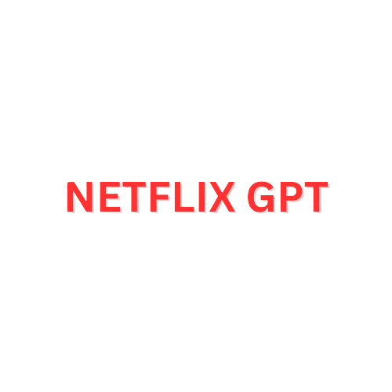
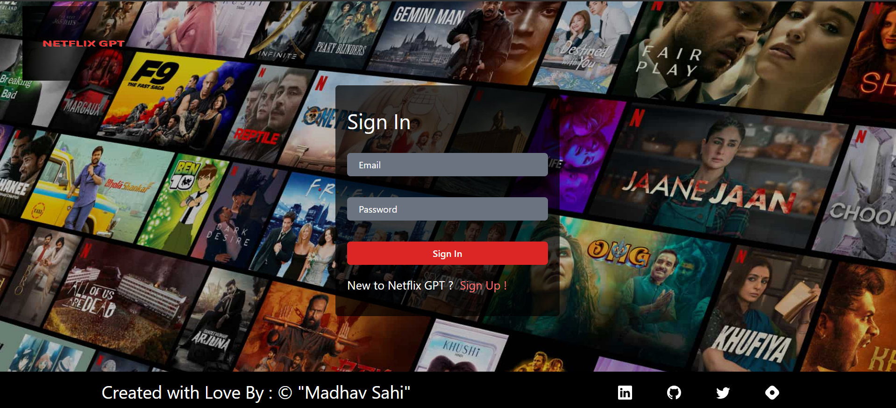
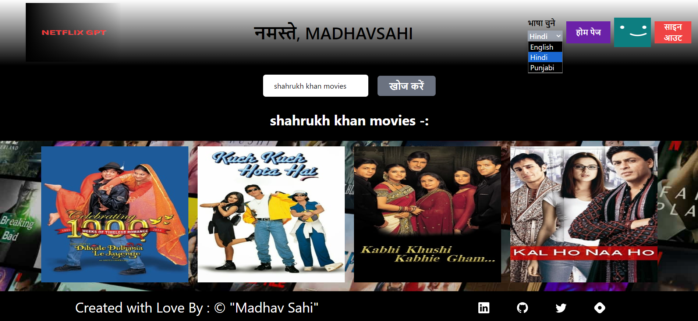

# <div align="center"> Netflix GPT </div>

<div align="center">
  
</div>
<br>
<!--  -->

Netflix GPT is a web application that leverages OpenAI's GPT-3.5 model to provide users with personalized movie recommendations based on natural language queries. It features user authentication, multi-language support, and an intuitive interface for exploring movie details. Designed with React JS, redux Toolkit, React Router DOM, Tailwind CSS and deployed on Netlify, the project demonstrates expertise in web development, Open AI Chat GPT integration, and responsive design.

## 📌 Live Demo

👉 [Visit Here - Netflix GPT](https://netflixgpt-open-ai-react-madhavsahi.netlify.app/ "Live Link")

## 📌 Repository

👉 [GitHub Repository - Netflix GPT](https://github.com/MadhavSahi/Netflix-ChatGPT "Repo Link")

## 📌 Libraries and Technologies Used

- **React**: A JavaScript library for building user interfaces.
- **React Router DOM**: For handling routing and navigation in the application.
- **Redux Toolkit**: To manage the global state and store.
- **React Icons**: To include various icons throughout the application.
- **Tailwind CSS**: For modular and responsive styling.
- **TMDP API**: For fetching video content and suggestions.
- **UUID**: For generating unique keys for elements.

## 📌 Key Features

### Firebase Authentication

- Netflix GPT uses Firebase Authentication to manage user profiles and enhance the user experience. Firebase Authentication provides secure, password-based sign-up and sign-in mechanisms. Here's how it works within the project:

- **User Profiles:** Users can create personalized profiles by signing up or signing in. This feature allows users to maintain their movie preferences and receive tailored recommendations.

- **Secure Authentication:** Firebase Authentication ensures the security of user credentials and provides a reliable authentication system for the application.

- **User Data Management:** User data, including email, display name, and other relevant information, is stored securely. This data is used to personalize the user experience.

- **Error Handling:** In case of authentication errors, such as invalid login credentials or user already exists, appropriate error messages are displayed to the user for a smooth sign-up and sign-in process.

### TMDB API Integration:

- The application seamlessly integrates with the TMDB APIs, allowing it to retrieve a wide range of video content directly from TMDB's vast movies library.
- Through the power of the `fetch` method, the app dynamically fetches movie details, including titles, descriptions, poster, and videos data, ensuring that users have access to the latest and most relevant videos.
- This real-time data integration keeps the content fresh and also provides users with a diverse selection of movies across various genres and interests.

### React Router DOM

- Utilizes React Router DOM for handling routing and navigation within the application.

- **Navigation:** Users can easily move between these sections by clicking on links, buttons, or navigation elements. The navigation is user-friendly and intuitive.

- **Protected Routes:** Certain routes are protected, meaning they are accessible only to authenticated users. Unauthorized users are redirected to the sign-in page, enhancing security and user access control.

### Redux State Management

- Employs Redux Toolkit to efficiently manage global state and store data. Ensures data consistency and accessibility across different components.
- Displaying Movie Trailer, Trending, Now Playing, Popular is achieved through Redux.

### Responsive Design

- The application is designed to be responsive, providing an optimal viewing experience on various devices and screen sizes. It adapts to different screen resolutions and orientations.

### Chat GPT Search Functionality

- Offers a robust search feature that allows users to search for movies by passing queries.
- Utilize the OpenAI GPT-3.5 model to generate personalized movie recommendations based on user input.
- Get instant movie suggestions for your next viewing.

### Memoization and Caching

- Implements memoization and caching techniques thorugh Redux to optimize API calls and reduce redundant network requests. This improves application performance and speeds up content retrieval.

### Multi-language Support

- Access multiple languages using the language selector.

## 📌 How to Run Locally

1. Clone the repository from [Netflix GPT : GitHub](https://github.com/MadhavSahi/Netflix-ChatGPT/tree/main).

   ```javascript
   git clone https://github.com/MadhavSahi/Netflix-ChatGPT.git
   ```

2. Navigate to the project directory.

   ```javascript
   cd netflixgpt
   ```

3. Install the dependencies. :-

   ```javascript
   npm install
   ```

4. Create a `.env` file in the project root and add your YouTube Data API key :-

   ```javascript
   REACT_APP_OPEN_AI = your - open ai - api - key -here;
   REACT_APP_TMDB_API = your - TMDB - api -key - here;
   REACT_APP_FIREBASE_API_KEY = your - api - key - here;
   REACT_APP_FIREBASE_AUTH_DOMAIN = your - auth - domain;
   REACT_APP_FIREBASE_PROJECT_ID = your - project - id;
   REACT_APP_FIREBASE_STORAGE_BUCKET = your - storage - bucket;
   REACT_APP_FIREBASE_MESSAGING_SENDER_ID = your - messaging - sender - id;
   REACT_APP_FIREBASE_APP_ID = your - app - id;
   ```

5. Start the development server.

   ```javascript
   npm start
   ```

6. Open your browser and visit [http://localhost:3000](http://localhost:3000) to view the app.

## 📌 Screenshots



<br>


<br>


<br>



## 📌 Tech Stack


## 📌 Future Improvements

- Movie Details page.
- Comments section for each movie.
- Implementing likes and rating for each movie.
- Further optimization for performance and user experience.
- Google Bard and Open AI GPT-4 implementation.

## 📌 Contributors

### Madhav Sahi

- Email : madhavsahi16@gmail.com
- LinkedIn - [Click here](https://www.linkedin.com/in/madhav-sahi-6a2305161/ "LinkedIn Link")
- GitHub - [Click here](https://github.com/MadhavSahi "GitHub Link")

## 📌 License

This project is licensed under the GNU General Public License (GNU GPL). See the [LICENSE](./LICENSE) file for details.

Feel free to contribute, report issues, or provide feedback!

## 📌 Acknowledgements

- Icons used for Tech Stack section :- [shields.io](https://img.shields.io)
